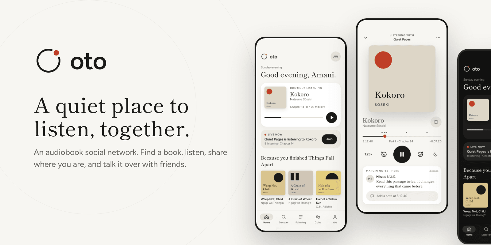
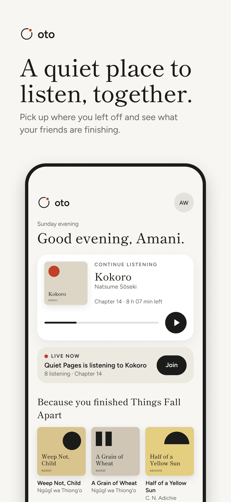
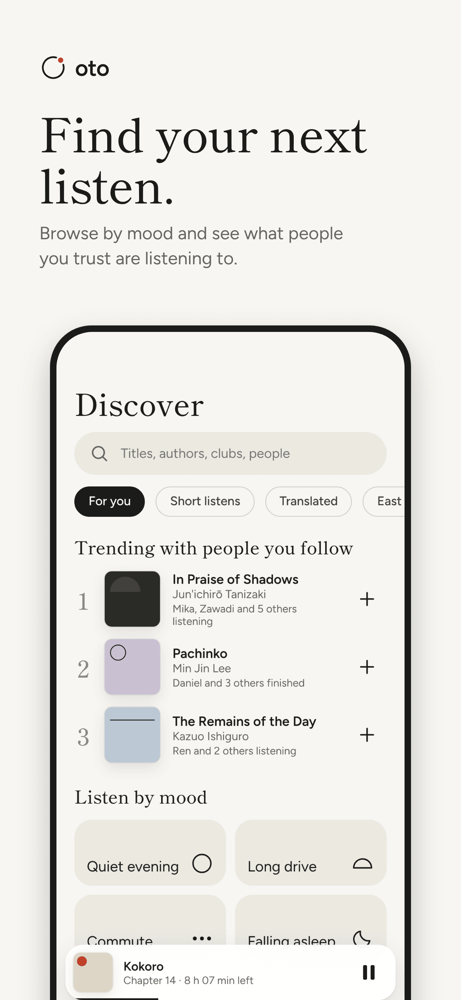
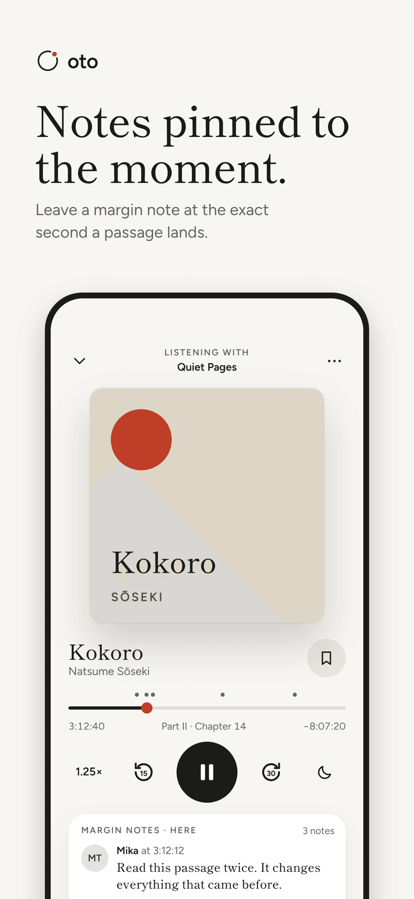
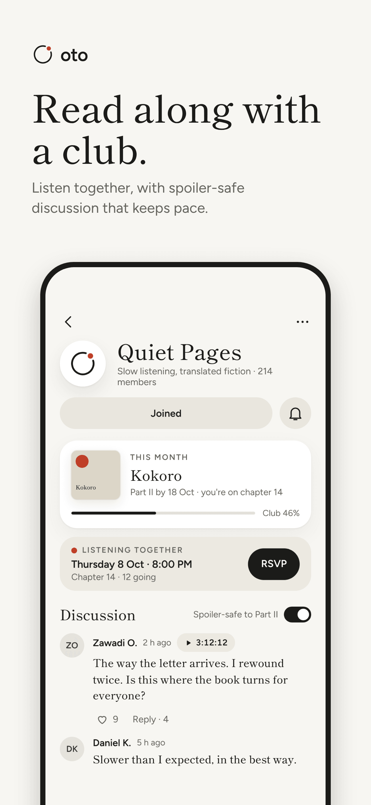
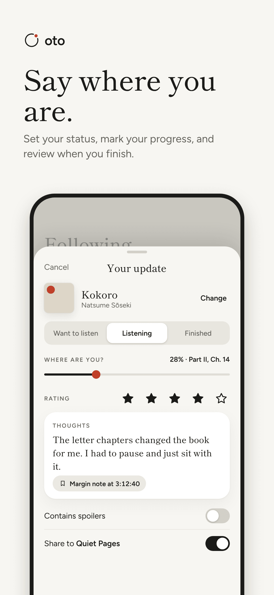
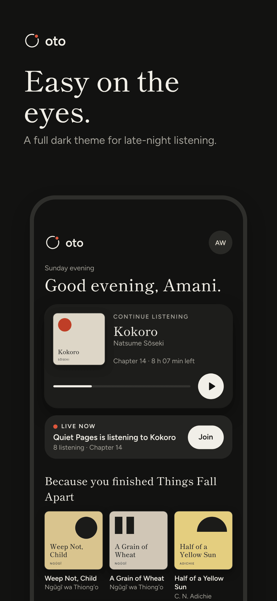

<div align="center">

<picture>
  <source media="(prefers-color-scheme: dark)" srcset="docs/images/logo-lockup-dark.png">
  
</picture>

**A quiet place to listen, together.**

An audiobook social network. Find a book, listen, share where you are, and talk it over with friends.

[](https://github.com/Olaw2jr/oto/actions/workflows/ci.yml)


</div>

<p align="center">
  
</p>

## About

oto (音, Japanese for "sound") is a social network built around audiobooks. You find a book, listen to it, say where you are in it, and talk it over with the people who are listening too. It brings together four things:

- **Find** books by mood, by what friends are finishing, and by search.
- **Listen** with a player that lets you pin a note to the exact second a passage lands.
- **Share** your status, your progress and your reviews.
- **Join** book clubs with spoiler-safe discussion that keeps pace with you.

The design takes its cues from Kenya Hara's emptiness and restraint, with Apple's large titles and translucent bars and Google's tonal containers and generous touch targets.

## Screens

> These are concept screens from the [oto design canvas](https://claude.ai/artifact/NtXhA3VnydXvCvepVidLL6), the source of truth for the design. They are not screenshots of the running app. See [Status](#status) for what is built.

<table>
  <tr>
    <td></td>
    <td></td>
    <td></td>
  </tr>
  <tr>
    <td align="center">Home</td>
    <td align="center">Discover</td>
    <td align="center">Player</td>
  </tr>
  <tr>
    <td></td>
    <td></td>
    <td></td>
  </tr>
  <tr>
    <td align="center">Book clubs</td>
    <td align="center">Status update</td>
    <td align="center">Dark mode</td>
  </tr>
</table>

## Status

This repository is a React Native app that started life as **Eyy** and is being rebranded to oto. It runs on mock data today.

| Area | State |
| --- | --- |
| Home feed, update details and threaded comments | Built |
| Discover, Books list and Book detail | Built |
| My Books shelves and Profile | Built |
| Player | Built |
| Splash, onboarding, sign in and create account | Designed, not built |
| Settings | Designed, not built |
| Book clubs | Designed, not built |
| Margin notes and status composer | Designed, not built |
| Light and dark theme switching | Designed. The app currently forces dark. |
| Backend and real catalogue | Not started |

## Design language

| Token | Light | Dark |
| --- | --- | --- |
| Paper (background) | `#F7F6F2` | `#121211` |
| Ink (text) | `#1B1B19` | `#F1EFE8` |
| Card | `#FFFFFF` | `#1D1D1B` |
| Muted | `#66655F` | `#A3A199` |
| Kaki (accent) | `#BF3E27` | `#E0543A` |

- **One accent.** Kaki, the vermilion of the logo dot, appears at most once per screen.
- **Type.** [Shippori Mincho](https://fonts.google.com/specimen/Shippori+Mincho) for titles and [Figtree](https://fonts.google.com/specimen/Figtree) for the interface. Both are bundled in `app/assets/fonts`.
- **Accessibility.** Touch targets are at least 44pt and text contrast is at least 4.5:1.

Colours come from the theme tokens in `app/theme/tokens.js`, never from raw hex values.

## Tech stack

- [React Native](https://reactnative.dev/) 0.70 with TypeScript
- [React Navigation](https://reactnavigation.org/) for stacks and tabs
- [tailwind-rn](https://github.com/vadimdemedes/tailwind-rn) for styling, with `bg-paper dark:bg-paper-dark` style token pairs
- [react-native-svg](https://github.com/software-mansion/react-native-svg) and [Heroicons](https://heroicons.com/) for graphics
- Jest and React Native Testing Library for tests

## Getting started

**Requirements**

- Node 18 (see `.nvmrc`)
- Xcode with CocoaPods for iOS, and Android Studio with JDK 11 for Android. Follow the React Native 0.70 [environment setup](https://reactnative.dev/docs/0.70/environment-setup).

**Run it**

```sh
npm install
(cd ios && pod install)   # iOS only
npm start                 # Metro bundler
npm run ios               # or: npm run android
```

## Scripts

| Script | What it does |
| --- | --- |
| `npm start` | Starts Metro |
| `npm run ios` / `npm run android` | Builds the app and runs it on a simulator or device |
| `npm test` | Runs the Jest test suite |
| `npm run lint` | Runs ESLint over JS/TS sources |
| `npm run typecheck` | Type-checks the project with `tsc --noEmit` |
| `npm run check` | Runs typecheck, lint and tests together |
| `npm run build:tailwind` | Regenerates `tailwind.json` for `tailwind-rn` |
| `npm run dev:tailwind` | Watches and regenerates `tailwind.json` |
| `npm run icons` | Regenerates the app icons |

## Project layout

```
app/
  assets/      images and fonts
  components/  shared UI components
  navigator/   stack and tab navigators
  screens/     one folder per screen
  theme/       design tokens
  utils/       mock data and helpers
docs/
  images/      logo, banner and App Store images
__tests__/     Jest tests, mirroring app/
```

## Quality

Run `npm run check` before opening a pull request. The same typecheck, lint and test steps run in [CI](.github/workflows/ci.yml) on every pull request.

## Brand assets

Everything lives in [`docs/images`](docs/images).

| Asset | Files |
| --- | --- |
| Logo mark (SVG) | [`logo.svg`](docs/images/logo.svg), [`logo-dark.svg`](docs/images/logo-dark.svg) |
| Logo lockup (PNG, transparent) | [`logo-lockup-light.png`](docs/images/logo-lockup-light.png), [`logo-lockup-dark.png`](docs/images/logo-lockup-dark.png) |
| App icon | [`app-icon.png`](docs/images/app-icon.png) |
| README banner | [`banner.png`](docs/images/banner.png) |
| App Store images (1290 × 2796) | [`app-store/`](docs/images/app-store) |

The mark is an open ring with a single vermilion dot: a sound wave, a listener, and a full stop. The name is a palindrome, so it reads the same from either end.

## Roadmap

1. **Theme foundation.** Move every screen onto the oto tokens and add a real light and dark switch.
2. **Shared components.** Buttons, cards, cover tiles, the five-tab bar and the mini player.
3. **Re-skin existing screens** to match the canvas.
4. **Welcome and account.** Splash, onboarding, sign in, create account and settings.
5. **Social features.** Book clubs, margin notes and the status composer.

## Contributing

Contributions are welcome. Please read [CONTRIBUTING.md](CONTRIBUTING.md) first. In short: branch names start with `feat/`, `fix/` or `chore/`, commits follow Conventional Commits, and pull requests are squash-merged.
